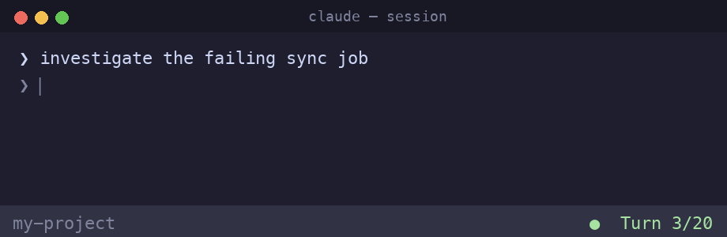

# claude-turn-counter

A tiny [Claude Code](https://claude.com/claude-code) add-on that keeps your context
window healthy. It puts a **live turn counter in your status bar** and gives you **one
gentle, non-blocking reminder** when a session runs long — so you can `/compact` or start
fresh *before* quality degrades, instead of noticing too late.



```
[your existing status bar]   ●  Turn 16/20
```

- 🟢 green while you have room
- 🟡 yellow at 15 turns (configurable) + a one-time reminder
- 🔴 red `— WRAP UP` at 20

The reminder is a soft `systemMessage` — it **never interrupts you mid-thought**. You finish
what you're doing, then `/compact` or open a new session when it suits you.

## Why

Long sessions quietly fill the context window; by the time you feel it, you've already lost
headroom. A visible counter plus a single nudge at a threshold you choose makes context
management a habit instead of an afterthought. The counter part is commodity — the point here
is the **wrap-up nudge at N turns**.

## Install

Requires Python 3 (already present if you use Claude Code) and an existing `~/.claude` config.

```bash
git clone https://github.com/joseph-ortiz/claude-turn-counter.git
cd claude-turn-counter
python install.py          # Windows: py install.py   (or python3 on macOS/Linux)
```

The installer:
1. Finds your config dir (`$CLAUDE_CONFIG_DIR` or `~/.claude`).
2. Copies three hook scripts into `<config>/hooks/`.
3. Backs up `settings.json` → `settings.json.bak-turncounter`.
4. **Wraps** any status bar you already have (yours is preserved, the counter is appended).
5. Points `statusLine` at the counter and adds a `Stop` hook for the reminder.

It's **idempotent** (safe to re-run) and cross-platform (Windows / macOS / Linux, no bash).

Takes effect on your **next** Claude Code session.

### Uninstall

```bash
python install.py --uninstall     # restores your original statusLine + removes the Stop hook
```

## Configure

Set thresholds via environment variables (defaults 15 / 20):

| Var | Default | Effect |
|-----|---------|--------|
| `WARN_LIMIT` | 15 | yellow color + the one-time reminder |
| `TURN_LIMIT` | 20 | red `— WRAP UP` color |

## How it works

Three ~50-line Python hooks in `hooks/`:

| File | Role |
|------|------|
| `count_turns.py` | Counts real user prompts in the session transcript (skips tool-result echoes). |
| `statusline_turns.py` | The `statusLine` command — runs your prior status bar (if any), appends `●  Turn N/LIMIT`. |
| `turn_reminder.py` | A `Stop` hook — fires once per session at `WARN_LIMIT`, emits a non-blocking `systemMessage`. |

Two Claude Code facts it relies on:
- **`statusLine` is a single command slot** — to add a segment you must *wrap* the existing
  command, not register a second one. The installer handles this.
- **A Stop hook that prints `{"systemMessage": "..."}` warns without interrupting**;
  `{"decision": "block"}` would force the model to continue. This tool only ever uses
  `systemMessage`.

## Contributing

Small, dependency-free, hard to break — see [CONTRIBUTING.md](CONTRIBUTING.md) for the
philosophy, the two invariants, and how to test hooks against a throwaway config dir.

## License

MIT — see [LICENSE](LICENSE).
